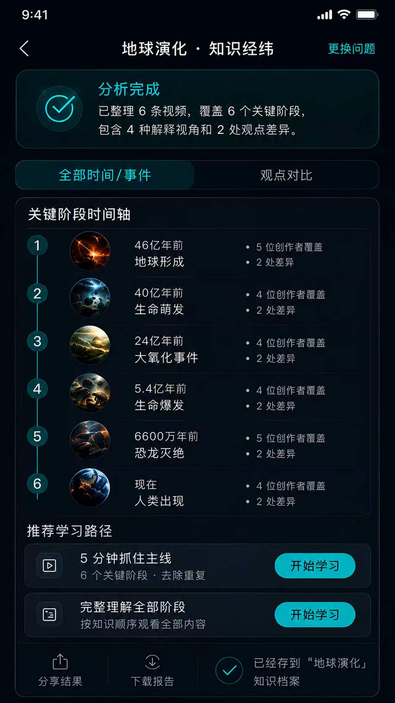
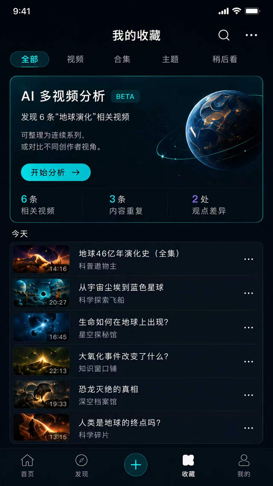
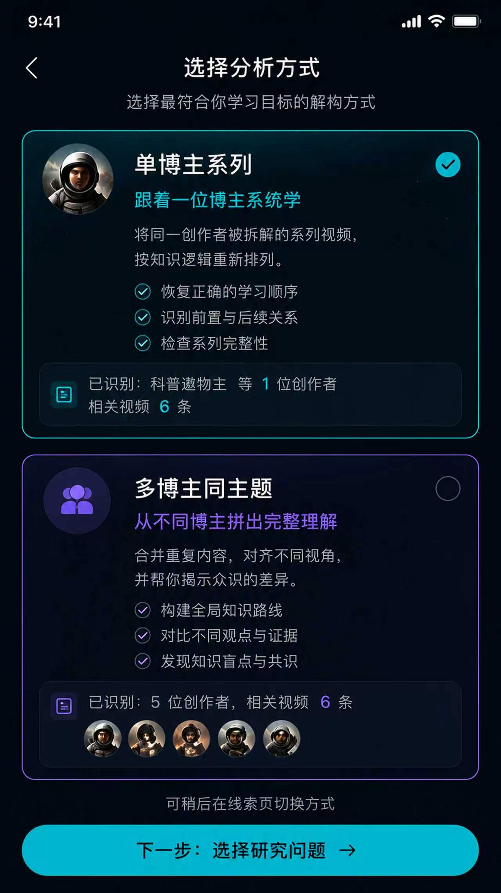
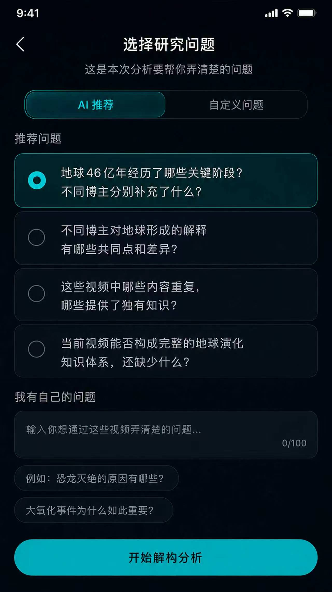
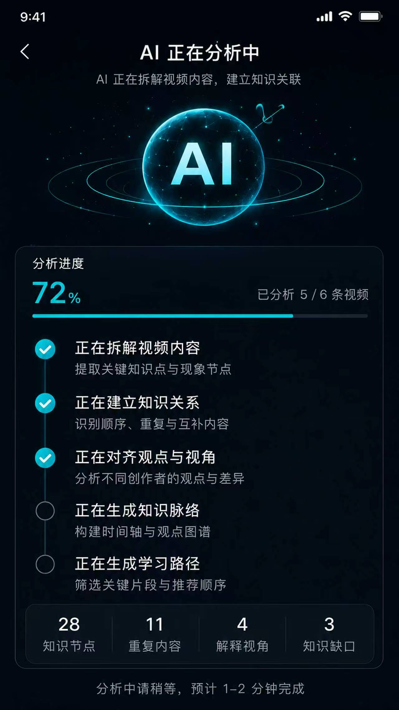
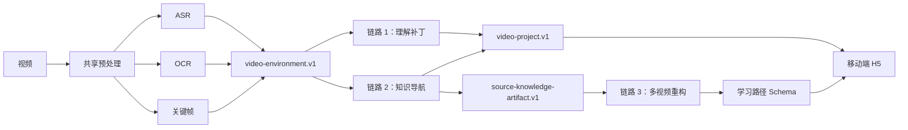

# 划重点 · Key Points

> **Understand the video, not just summarize it.**
>
> 面向科普与知识类视频的 AI 理解、导航与多视频知识重构 Demo。


## 三链路产品体验

**即时看懂 → 单视频导航 → 多视频知识重构**

| 链路 1 · 即时看懂 | 链路 2 · 单视频导航 | 链路 3 · 多视频知识重构 |
| --- | --- | --- |
|  |  |  |
| 在用户可能卡住的时间点给出轻提示，展开后用直观表达补懂。 | 把一条视频拆成可定位、可回看的知识点与解释区间。 | 把 3–10 条同主题视频重构成可追溯的学习路径。 |

链路 1 与链路 2 截图对应当前已实现交互。链路 3 截图是**产品流程设计**；当前 H5 已实现同一五步流程和状态，但不声称与设计图像素级一致。

## 为什么做「划重点」

普通视频摘要回答“这段视频说了什么”，但学习者真正遇到的是三个连续问题：

- **当下没看懂**：抽象数字、论断或陌生概念需要恰到好处的解释；
- **看完记不住结构**：需要按问题、答案和完整时间区间定位内容；
- **收藏很多却无法学习**：需要去重、补齐关系，并按研究目标重新组织多条视频。

因此项目把能力拆成三条彼此复用、可独立校验的链路：

| 链路 | 回答的问题 | 核心输出 | 产品行为 |
| --- | --- | --- | --- |
| 链路 1 · 理解补丁 | “为什么这里可能看不懂？” | 观念质疑、数字体感、概念补懂 | 轻提示 → 展开解释 → 忽略后可找回 |
| 链路 2 · 知识导航 | “这条视频正在讲什么？” | 问题、答案、证据、完整解释区间 | 列表导航、跳转与区间回看 |
| 链路 3 · 知识重构 | “这些视频如何拼成一条学习路线？” | 标准知识节点、关系、研究问题、学习路径 | 选择 3–10 条视频后生成可回溯路径 |

## 产品流程

### 链路 1：播放中的即时理解补丁

链路 1 聚焦三类高价值障碍：

1. **观念质疑**：补充适用人群、条件和不同场景；
2. **数字体感**：把温度、距离、比例等抽象数字变成可感知对比；
3. **概念补懂**：用一句话与视觉表达补齐陌生术语。

主视觉使用用户授权的“65°C 有多烫”展开卡，展示“轻提示 → 展开解释”的实际产品表达。

<p align="center">
  
</p>

### 链路 2：单视频知识导航

链路 2 不把“出现关键词的瞬间”当作知识点，而是绑定完整解释区间，并保留问题、答案、证据引用和审核状态。H5 只消费通过公开契约的稳定结果，不暴露候选卡、选择分数或内部审核 Trace。

<p align="center">
  
</p>

### 链路 3：多视频知识重构

链路 3 只接受 **3–10 条已完成解析、主题相关的视频**。它复用链路 2 的知识产物，不重复执行 ASR、OCR 或关键帧抽取。

> 下列原始设计截图用于说明目标流程；当前 H5 是可运行实现，但视觉并非像素级复刻。

| 1. 收藏 / 发现视频 | 2. 选择分析方式 | 3. 选择研究问题 |
| --- | --- | --- |
|  |  |  |

| 4. AI 分析 | 5. 知识经纬结果 |
| --- | --- |
|  |  |

长期产品规则见 [链路 3 产品说明](docs/chain3-product.md)。

三条链路的页面路由与 Fixture 均可在本地 H5 复现。真实视频上传、ASR、OCR、关键帧抽取及后端链路的验证边界见 [真实视频验证记录](docs/real-video-validation.md)。

## 架构



模型输出不会直接进入前端，而要经过 Schema、完整性、时间范围、来源追溯、Grader、fallback 与审核状态检查。稳定边界为：

- `video-environment.v1`：一次视频解析形成的共享证据；
- `video-project.v1`：单视频 H5 消费的公开结果；
- `source-knowledge-artifact.v1`：链路 2 交给链路 3 的可复用知识产物；
- 链路 3 Learning Path Schema：研究问题驱动、节点可回到原视频片段的路径结果。

## 当前实现

已实现：

- React + TypeScript 移动端 H5 与零密钥 Fixture；
- FastAPI 上传、抖音公开分享解析、异步任务、状态轮询与媒体读取；
- Whisper / FunASR 适配、OCR、关键帧、语义分段与共享证据层；
- 链路 1 三类理解补丁、图片路线、时间窗校验与 fallback；
- 链路 2 知识提取、审核、完整解释区间与来源产物；
- 知识池及链路 3 的 S0–S7 固定编排、缓存、Grader、Trace 和局部重跑；
- 单博主系列与多博主同主题两种多视频模式；
- Fixture Provider 与 OpenAI-compatible Provider；
- 可交付的统一调用 Skill：[delivery/huazhongdian-video-harness](delivery/huazhongdian-video-harness)。

## Quick Start

### A. 只体验 H5（无需 API Key）

```bash
git clone https://github.com/5JjiaLin/key-points-ai-video.git
cd key-points-ai-video/h5
npm ci
npm run dev
```

浏览器打开终端给出的地址，即可体验内置 Fixture 与页面路由。

### B. 启动完整本地链路

环境要求：Python 3.11+、Node.js 20+、npm、`ffmpeg` / `ffprobe`。

```bash
git clone https://github.com/5JjiaLin/key-points-ai-video.git
cd key-points-ai-video

python3 -m pip install -e video_pipeline \
  -e video_analysis_harness \
  -e '链路2_harness[media]' \
  -e backend

cd 链路1_harness && npm ci && npm run build && cd ..
cd 链路3_harness && npm ci && cd ..
cp .env.example .env
```

默认可先用链路 3 的 Fixture Provider，无需模型密钥：

```bash
# Terminal 1：链路 3 Harness
cd 链路3_harness
HARNESS_PROVIDER=fixture npm run serve

# Terminal 2：Backend
set -a && source .env && set +a
PYTHONPATH="$PWD/backend:$PWD/video_pipeline/src:$PWD/video_analysis_harness/src:$PWD/链路2_harness/src" \
  python3 -m uvicorn app.main:app --app-dir backend --host 127.0.0.1 --port 8000

# Terminal 3：H5
cd h5
npm ci
VITE_API_BASE_URL=http://127.0.0.1:8000 npm run dev
```

如需真实模型，把 `.env` 中的服务端 Provider、模型地址和密钥配置完整。密钥不得写入 H5、Skill、Trace 或 Git。

## Backend API

| Method | Path | 用途 |
| --- | --- | --- |
| `GET` | `/api/health` | Backend 与链路 3 健康检查 |
| `GET` | `/api/showcase` | 获取 H5 展示入口 |
| `POST` | `/api/videos` | 上传视频并创建单视频任务 |
| `POST` | `/api/videos/from-douyin` | 从公开抖音分享文本 / URL 导入 |
| `GET` | `/api/jobs/{job_id}` | 查询单视频任务状态 |
| `GET` | `/api/jobs/{job_id}/result` | 获取 `video-project.v1` |
| `POST` | `/api/jobs/{job_id}/retry` | 重试可恢复失败 |
| `GET` | `/api/media/{job_id}/{path}` | 读取任务媒体与生成资源 |
| `GET` | `/api/knowledge-pool` | 列出知识池 |
| `POST` | `/api/knowledge-pool/items` | 加入已完成视频 |
| `DELETE` | `/api/knowledge-pool/items/{job_id}` | 从知识池移除 |
| `POST` | `/api/reconstructions` | 从 3–10 条视频创建重构任务 |
| `GET` | `/api/reconstructions/{analysis_id}` | 查询重构状态 |
| `GET` | `/api/reconstructions/{analysis_id}/result` | 获取问题推荐或最终结果 |
| `POST` | `/api/reconstructions/{analysis_id}/path` | 按研究问题生成学习路径 |

## Repository

```text
key-points-ai-video/
├── backend/                         # FastAPI 与三链路编排
├── h5/                              # React + TypeScript 移动端界面
├── video_pipeline/                  # ASR、OCR、关键帧与共享证据
├── video_analysis_harness/          # 单视频统一编排
├── shared_harness_protocol/         # 跨链路稳定协议
├── 链路1_harness/                   # 理解补丁
├── 链路2_harness/                   # 知识导航与审核
├── 链路3_harness/                   # 多视频重构运行时
├── 链路3_skill/                     # S0–S7 Skill 与 Schema
├── delivery/huazhongdian-video-harness/ # 对外统一调用 Skill
├── docs/                            # 产品说明与公开视觉证据
└── deploy/                          # 脱敏部署模板（不会自动部署）
```

## Validation

截至 **2026-08-18**，共 **140 项自动化测试**通过：

| Surface | Tests |
| --- | ---: |
| `video_pipeline` | 12 |
| `链路2_harness` | 47 |
| `video_analysis_harness` | 4 |
| `backend` | 18 |
| `链路1_harness` | 43 |
| `链路3_harness` | 7 |
| `h5` | 9 |
| **Total** | **140** |

复现命令：

```bash
PYTHONPATH="$PWD/video_pipeline/src" \
  python3 -m unittest discover -s video_pipeline/tests

PYTHONPATH="$PWD/链路2_harness/src:$PWD/video_pipeline/src" \
  python3 -m unittest discover -s 链路2_harness/tests

PYTHONPATH="$PWD/video_analysis_harness/src:$PWD/video_pipeline/src" \
  python3 -m unittest discover -s video_analysis_harness/tests

PYTHONPATH="$PWD/backend:$PWD/video_pipeline/src:$PWD/video_analysis_harness/src:$PWD/链路2_harness/src" \
  python3 -m unittest discover -s backend/tests

(cd 链路1_harness && npm test && npm audit)
(cd 链路3_harness && npm test && npm audit)
(cd h5 && npm test && npm run build && npm audit)
```

发布门禁还包括 `git diff --check`、暂存树与全部公开 Git refs 的 gitleaks 扫描，以及 375×812 移动端关键状态验收。

## Limitations

- 这是产品 Demo，不是生产级视频平台；尚无账号、生产转码、云端笔记或运营后台；
- 仓库不公开原始测试视频、人物关键帧、运行 Trace、服务器信息或本地路径；
- Fixture 用于可复现交互，不代表模型实时生成或真实准确率；
- ASR 在人名、术语和同音词上仍可能出错；缺少证据时系统会返回不足或拒绝，不伪造结论；
- 链路 3 只在 3–10 条主题相关、已完成解析的视频上运行；混合主题被质量门拒绝属于正确行为；
- 当前验证证明工程链路与结构约束可工作，不等于已证明学习效果、完播率或满意度提升。

## License

源码采用 [MIT License](LICENSE)。截图、视频帧、插图、设计图及其他视觉素材**不在 MIT 授权范围内**，详见 [ASSET_LICENSE.md](ASSET_LICENSE.md)。
