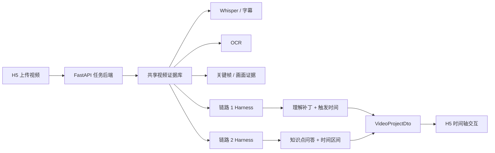

# 划重点 · Key Points

> **面向科普与知识类短视频的 AI 内容理解与知识导航产品。**  
> 不只是总结视频，而是在视频时间轴上同时回答两件事：**“现在在讲什么？”** 和 **“这里我真的看懂了吗？”**

<p align="center">
  
  
  
  
  
</p>

---

## 为什么做「划重点」

知识视频的问题往往不是“没有信息”，而是用户在观看过程中会遇到三种断层：

- **听到了，但没有概念**：例如“65℃”“800V”到底意味着什么；
- **听到了，但不知道能不能信**：一句结论是否过于绝对、需要什么前提；
- **听到了，但前置知识缺失**：博主默认用户理解某个专业词或机制，实际并没有。

同时，视频天然是线性媒介。用户很难快速知道整条视频的知识结构、当前讲到哪里、结论是什么，以及之后如何准确跳回对应片段。

「划重点」尝试给视频增加一层 **AI 知识导航层**，让用户在不离开播放场景的情况下理解、定位和回看知识。

---

## 核心设计：两条 AI 链路

| | 链路 1 · 内容理解补丁 | 链路 2 · 视频知识导航 |
|---|---|---|
| 解决什么 | 帮助用户真正看懂某个具体表达 | 告诉用户整条视频正在讲什么 |
| 识别内容 | 抽象数字、可疑说法、知识断层 | 主干知识点与讲解区间 |
| 页面形态 | 到达时间点后出现轻提示，可展开详情 | 播放期间常驻显示当前问题、进度和答案 |
| 用户忽略后 | 自动进入“本视频知识点” | 始终跟随视频时间轴 |
| 回看方式 | 查看对应补充解释 | 跳回知识点讲解起点 |

一句话区分：

> **链路 2 负责告诉用户“视频正在讲什么”；链路 1 负责帮助用户“真正看懂”。**

### 链路 1：内容理解补丁

当前聚焦三类理解障碍：

1. **把抽象数字变直观**：用熟悉参照、区间或现实场景解释数字；
2. **验证视频说法**：判断“基本准确 / 有条件成立 / 表达过于绝对 / 存在争议 / 证据不足”；
3. **补上知识断层**：对专业词、机制或默认前置知识做一句话补充解释。

### 链路 2：视频知识导航

把视频主干知识重构成可跟随时间轴的知识节点：

- 当前正在回答什么问题；
- 这个知识点从哪里开始、到哪里结束；
- 当前讲解还剩多久；
- 讲完后的简短结论是什么；
- 点击后如何快速跳回对应片段。

---

## 当前 Demo 能做什么

当前仓库包含一条可运行的本地真实视频链路：



已实现的主路径包括：

- H5 上传真实视频并创建异步解析任务；
- Whisper / OCR / 关键帧共享证据提取；
- 链路 1 生成与时间轴绑定的理解补丁；
- 链路 2 生成知识点问题、答案与讲解时间段；
- 后端统一返回毫秒制 `VideoProjectDto`；
- H5 根据播放时间驱动知识提示、进度与回看交互；
- 任务状态、失败信息与重试接口；
- 本地任务状态持久化，刷新后可继续查询。

> 当前是产品 Demo / Harness 验证仓库，不是生产级视频平台。账号体系、生产级转码、云端笔记同步等不在当前范围内。

---

## 项目结构

```text
region-contest/
├── h5/                 # 移动端优先 H5，React + TypeScript + Vite
├── backend/            # FastAPI 任务后端与 VideoProjectDto 接口
├── video_pipeline/     # 视频解析、Whisper/OCR/关键帧证据管线
├── 链路1_harness/      # 内容理解补丁的 Harness 与验证
├── 链路2_harness/      # 视频知识导航的 Harness 与验证
├── 链路1skill/         # 链路 1 Skill 设计
├── 链路2skill/         # 链路 2 Skill 设计
├── docs/               # 真实视频验收与开发文档
└── AGENTS(1).md        # 当前产品决策与开发约束
```

---

## Quick Start

### 环境要求

- macOS（当前主要验证环境）
- Python 3.11+
- Node.js / npm
- `ffmpeg` / `ffprobe`

### 1. 克隆并安装依赖

```bash
git clone https://github.com/5JjiaLin/region-contest.git
cd region-contest

python3 -m pip install -e video_pipeline -e '链路2_harness[media]' -e backend

cd 链路1_harness
npm ci --registry=https://registry.npmjs.org
npm run build

cd ../h5
npm ci --registry=https://registry.npmjs.org
cd ..
```

### 2. 配置环境变量

```bash
cp .env.example .env
```

只在服务端 `.env` 中填写模型服务所需凭据。**不要把真实 API Key 提交到仓库，也不要使用 `VITE_*` 将服务端密钥暴露到前端。**

### 3. 启动后端

```bash
set -a && source .env && set +a
PYTHONPATH='backend:video_pipeline/src:链路2_harness/src' \
  python3 -m uvicorn app.main:app --app-dir backend --host 0.0.0.0 --port 8000
```

### 4. 启动 H5

另开一个终端：

```bash
cd h5
npm run dev -- --host 0.0.0.0
```

电脑访问 Vite 输出的本地地址；手机与 Mac 位于同一 Wi-Fi 时，可直接访问 Vite 输出的 `Network` 地址。

---

## API

| Method | Endpoint | 作用 |
|---|---|---|
| `POST` | `/api/videos` | 上传视频并创建任务 |
| `GET` | `/api/jobs/{jobId}` | 查询阶段、进度、错误与重试状态 |
| `POST` | `/api/jobs/{jobId}/retry` | 重试失败任务 |
| `GET` | `/api/jobs/{jobId}/result` | 获取 `VideoProjectDto` |
| `GET` | `/api/media/{jobId}/{path}` | 获取视频、关键帧及生成资源 |

---

## 验证

```bash
PYTHONPATH='video_pipeline/src' python3 -m unittest discover video_pipeline/tests
PYTHONPATH='video_pipeline/src:链路2_harness/src' python3 -m unittest discover 链路2_harness/tests
PYTHONPATH='backend:video_pipeline/src:链路2_harness/src' python3 -m unittest discover backend/tests

cd 链路1_harness && npm test
cd ../h5 && npm test && npm run build
```

真实视频验收记录见 [`docs/real-video-validation.md`](docs/real-video-validation.md)。

---

## 当前阶段

这个仓库记录「划重点」在大区赛阶段的产品 Demo、AI Harness 与真实视频验证过程。

当前重点不是继续堆功能，而是验证三个问题：

1. AI 能否稳定识别真正影响用户理解的内容，而不是泛泛总结；
2. 知识点能否准确绑定到视频时间区间，而不是只定位关键词；
3. 两条 AI 链路能否同时工作，又不打断原本的视频观看体验。

如果这些问题成立，视频就不再只是从头播到尾的一条内容流，而可以变成一张可理解、可定位、可回看的知识地图。
