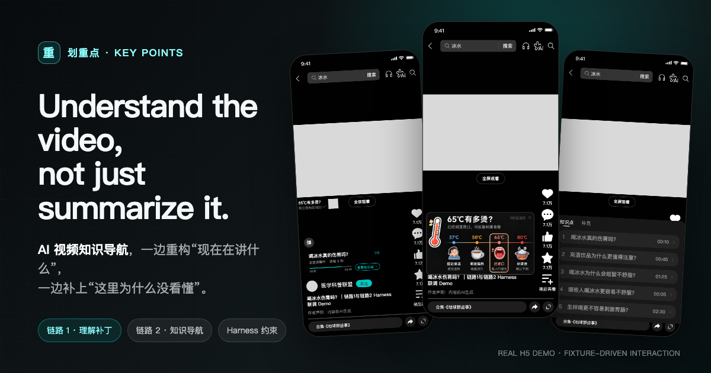
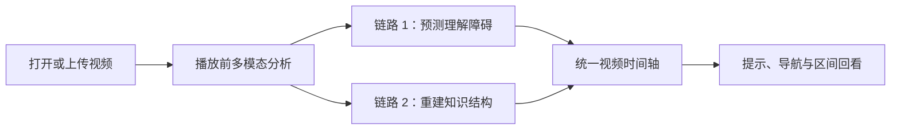
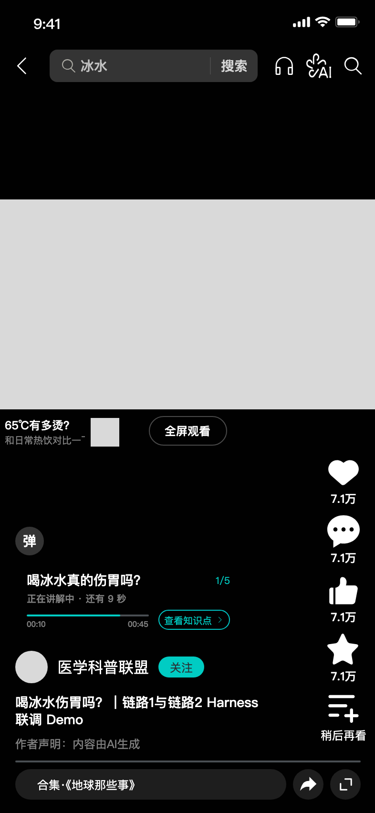
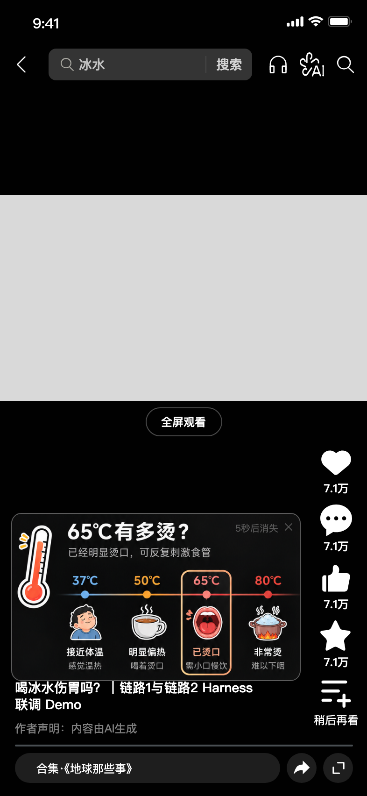
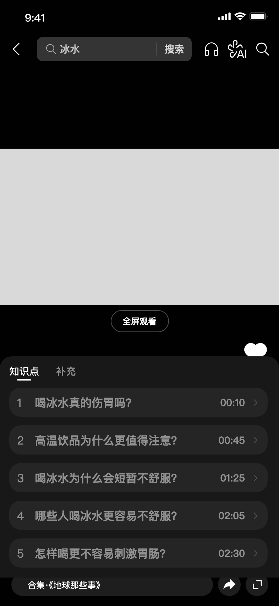
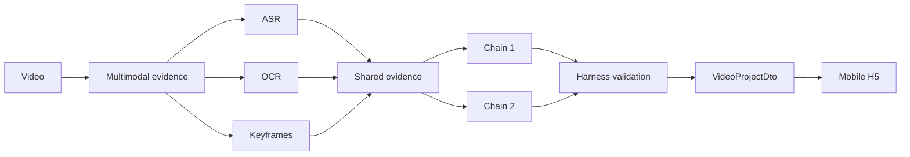

# 划重点 · Key Points

> **Understand the video, not just summarize it.**
>
> 面向科普与知识类短视频的 AI 内容理解与知识导航 Demo。


<p align="center">
  
</p>

> Hero 中的界面来自仓库内真实运行的 H5。灰色视频区域用于避免把无公开授权的第三方视频放入仓库；Fixture 驱动的交互、状态和时间轴均为实际产品代码。

## Why Key Points

普通视频摘要回答的是“这段视频说了什么”，但用户真正卡住的时刻发生在播放过程中：

- **现在在讲什么？** 我需要快速定位知识结构、问题和答案。
- **这里我真的看懂了吗？** 抽象数字、论据跳跃或陌生概念需要恰到好处的解释。

「划重点」不是另一个摘要生成器，而是叠加在视频时间轴上的 **AI 知识导航层**：先理解整段内容，再在正确的时间提供知识点导航与理解补丁。

## How It Works



## Two AI Pipelines

| Pipeline | 回答的问题 | 核心输出 | 产品行为 |
| --- | --- | --- | --- |
| 链路 1 · 理解补丁 | “为什么这里可能看不懂？” | 观念质疑、数字体感、概念补懂及补充解释 | 在相关时间窗轻量提示；展开后查看完整解释；忽略后仍可找回 |
| 链路 2 · 知识导航 | “这段视频正在讲什么？” | 主知识点、问题、答案、完整解释区间 | 常驻知识地图；点击可跳转并回看完整区间 |

> **链路 2 负责告诉用户“视频正在讲什么”；链路 1 负责帮助用户“真正看懂”。**

链路 1 聚焦三类高价值障碍，并为每类提供“轻提示 → 展开解释”两级状态：

1. **观念质疑**：识别绝对化或容易误解的说法，从不同人群与场景补充条件；
2. **数字体感**：把温度、距离、比例等抽象数字转成可感知的日常对比；
3. **概念补懂**：用一句话和视觉解释补齐陌生术语，降低继续观看的理解门槛。

链路 2 不把“出现关键词的瞬间”当作知识点，而是绑定一个包含完整解释的时间范围，保留问题、答案与证据引用。

## Demo

<p align="center">
  
  
  
</p>

| 时间轴 | 理解补丁 | 知识地图 |
| --- | --- | --- |
| 显示当前问题、讲解状态与剩余时间 | 在用户可能卡住时补充直觉化解释 | 用问题、答案和时间范围重建视频结构 |

以上截图来自内置 Fixture，便于零密钥复现交互。真实视频上传、ASR、OCR、关键帧抽取及后端链路已单独验证，证据与边界见 [真实视频验证记录](docs/real-video-validation.md)。

## AI Pipeline



### 为什么需要 Harness

模型输出不会直接进入前端，而要经过一条可验证的结构化管线：

```text
Model output
  → JSON Schema
  → 内容完整性检查
  → 时间点 / 时间范围检查
  → fallback 与审核状态
  → 稳定的 VideoProjectDto
```

实现分别位于 [链路1_harness](链路1_harness) 与 [链路2_harness](链路2_harness)。

## Product Decisions

| 决策 | 原因 |
| --- | --- |
| 双链路分工而非单次摘要 | “内容结构”与“理解障碍”是两类不同问题 |
| 播放前分析而非边播边生成 | 保证时间轴一致，避免提示延迟和内容漂移 |
| 绑定完整解释区间 | 用户回看时需要上下文，而不是一个关键词时间点 |
| 理解补丁不遮挡视频 | 提示应帮助观看，而不是打断观看 |
| 被忽略的提示仍保留 | 用户当下不需要，不代表之后无法找回 |
| 密钥只留在服务端 | 浏览器不接触模型或云服务凭证 |

## Current Implementation

已实现：

- 可直接运行的移动端 H5 与零密钥 Fixture；
- 真实视频上传、FastAPI 异步任务与状态轮询；
- Whisper ASR、OCR、关键帧与共享证据层；
- 链路 1 三类理解补丁、时间窗校验与 fallback；
- 链路 2 问题、答案、解释区间、证据 ID 与时间排序；
- 毫秒级统一 `VideoProjectDto`；
- H5 加载、失败、空结果、提示、忽略、展开与时间跳转状态。

当前边界：

- 这是产品 Demo，不是生产级视频平台；
- 尚未包含账号体系、生产转码、云端笔记或运营后台；
- 仓库不包含无公开授权的原始视频、关键帧或运行 trace；
- 当前验证证明工程链路、结构约束和 fallback 可工作，不等于已经证明模型准确率或用户学习效果。

## Quick Start

### A. 只体验产品交互（无需 API Key）

```bash
git clone https://github.com/5JjiaLin/region-contest.git
cd region-contest/h5
npm ci
npm run dev
```

浏览器打开终端给出的地址，点击任意视频卡片即可进入 Fixture Demo。

### B. 运行真实视频链路

环境要求：

- macOS 或 Linux
- Python 3.11+
- Node.js 与 npm
- `ffmpeg` / `ffprobe`

```bash
cd region-contest
python3 -m pip install -e video_pipeline -e '链路2_harness[media]' -e backend

cd 链路1_harness
npm ci
npm run build
cd ..

cp .env.example .env
```

按 [.env.example](.env.example) 配置服务端密钥，然后分别启动：

```bash
# Terminal 1
set -a && source .env && set +a
PYTHONPATH="$PWD/backend:$PWD/video_pipeline/src:$PWD/链路2_harness/src" \
  python3 -m uvicorn app.main:app --app-dir backend --host 127.0.0.1 --port 8000

# Terminal 2
cd h5
npm ci
VITE_API_BASE_URL=http://127.0.0.1:8000 npm run dev
```

真实上传链路通过后端访问模型服务；不要把任何密钥写入 H5 环境变量或提交到 Git。

## Architecture / Repository

```text
region-contest/
├── backend/            # FastAPI 上传、任务编排与 DTO 输出
├── h5/                 # React + TypeScript 移动端产品界面
├── video_pipeline/     # 视频探测、ASR、OCR、关键帧与证据归一化
├── 链路1_harness/      # 理解补丁生成、校验与 fallback
├── 链路2_harness/      # 知识点生成、审核、区间与证据校验
├── docs/               # 真实视频验证与产品视觉证据
├── .env.example        # 安全的配置模板
└── AGENTS.md           # 项目契约、数据结构与验收边界
```

## API

| Method | Path | 用途 |
| --- | --- | --- |
| `GET` | `/api/health` | 服务健康检查 |
| `POST` | `/api/videos` | 上传视频并创建分析任务 |
| `GET` | `/api/jobs/{job_id}` | 查询阶段、进度、错误与重试状态 |
| `POST` | `/api/jobs/{job_id}/retry` | 重试可恢复的失败任务 |
| `GET` | `/api/jobs/{job_id}/result` | 获取统一 `VideoProjectDto` |
| `GET` | `/api/media/{job_id}/{path}` | 读取任务媒体与生成资源 |

## Validation

截至 **2026-08-18**，仓库内共有 **65 项自动化测试**通过：

| Surface | Tests |
| --- | ---: |
| video_pipeline | 8 |
| 链路2_harness | 41 |
| backend | 3 |
| 链路1_harness | 12 |
| h5 | 1 |

同时通过 H5 production build 与 npm audit。关键命令：

```bash
PYTHONPATH="$PWD/video_pipeline/src" python3 -m unittest discover -s video_pipeline/tests
PYTHONPATH="$PWD/链路2_harness/src:$PWD/video_pipeline/src" python3 -m unittest discover -s 链路2_harness/tests
PYTHONPATH="$PWD/backend:$PWD/video_pipeline/src:$PWD/链路2_harness/src" python3 -m unittest discover -s backend/tests

cd 链路1_harness && npm test
cd ../h5 && npm test && npm run build && npm audit
```

真实视频验证覆盖一条约 138 秒短视频与一条约 732 秒长视频。完整数据、fallback 情况与未通过项见 [docs/real-video-validation.md](docs/real-video-validation.md)。

## Limitations

- 仓库不公开原始 Demo 视频，因此 Fixture 不代表模型实时生成；
- Whisper `base/int8` 在人名、术语和同音词上仍可能产生转写错误；
- 当论断缺少独立来源时，验证层会明确返回“证据不足”，不会伪造结论；
- 长视频曾触发云模型 fallback，准确率仍需在稳定云环境和人工标注集上重跑；
- 尚无用户研究可以证明它提升了理解率、完播率或满意度。

## License

本仓库目前**未声明开源许可证**。公开可见不等于授权复制、修改或分发；许可证将在明确代码与素材授权范围后补充。
